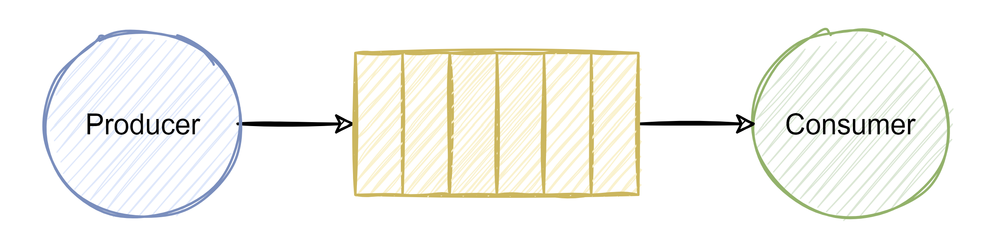
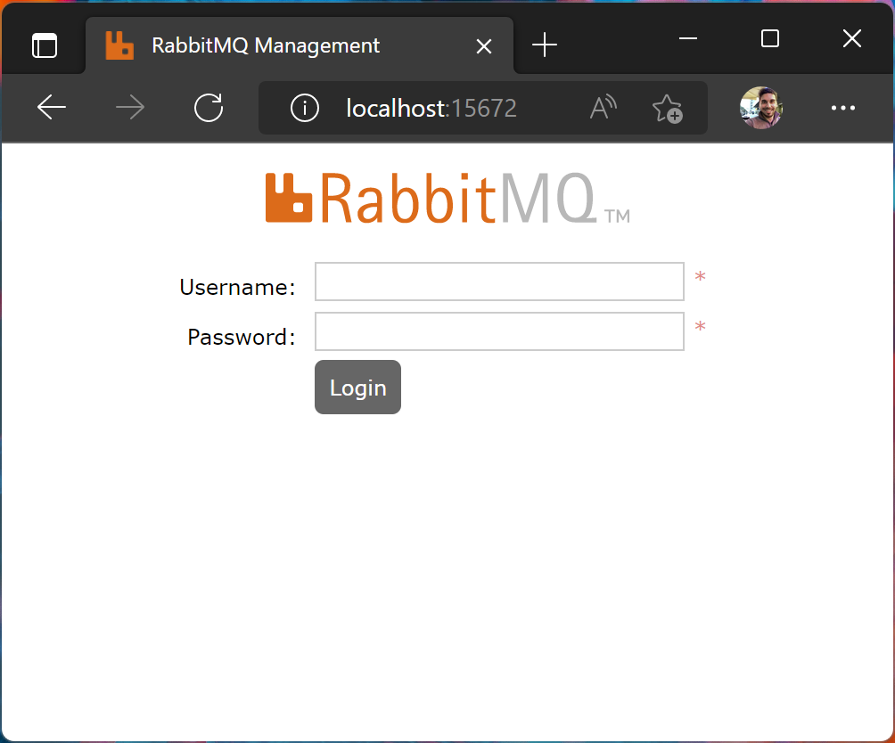

# RabbitMQ in Dotnet Core

This is a Demo project using RabbitMQ in Dotnet Core console application, for learning purposes 🎓

In this Demo we will use a queue for message communication between a producer application and a consumer application.



One of the concepts when using microservices is the communication between microservices and having a decoupled communication using something like a message queue. And RabbitMQ fits right in there.

RabbitMQ is a message broker so lets see first what a message broker is.

# What is a message broker?

You can think of a message broker like a post office. Its main responsibility is to broker messages between publisher and subscribers.

Once a message is received by a message broker from a producer, it routes the message to a subscriber.

- **Producer** is an application responsible for sending messages
- **Consumer** is an application listening for messages
- **Queue** is where the messages are stored by the broker (is the storage)

Message broker pattern is one of the most useful patterns when it comes to decoupling microservices.

# RabbitMQ

Is an open source message broker and it is probably one of the most widely used message broker out there.

[📄 Official RabbitMQ documentation](https://www.rabbitmq.com/documentation.html)

## 👍 Advantages

- Extremely lightweight and very easy to deploy
- Supports multiple protocols
- It has a management interface
- Highly available and scalable

## 👎 Disadvantages

- Not reliable for large data sets
- Non-transactional by default

## Protocols

As we can see in the Pros, RabbitMQ supports a bunch of them but the main protocol, out of the box is the AMQP 0-9-1.

AMQP 0-9-1 is a binary messaging protocol specification. This is the core protocol specification implemented in RabbitMQ. All other protocol support is through plug-ins.

### Other protocols supported

- **STOMP** - text based message protocol
- **MQTT** - binary protocol focusing mainly on Publish/Subscribe scenarios
- **AMQP 1.0** - it is a newer version than the AMQP 0-9-1 but it is completely different, much more complex and, according to the documentation, it is not supported by most of the clients
- **HTTP and WebSocket**

## Exchanges

### What is an exchange? 🤔

They are exchanges for messages. Just like stock exchanges where people exchanges stocks, a seller sells stock to a buyer. The exchange acts as a router of the stocks.

Similarly, exchanges in RabbitMQ routes messages from a producer to a single or a group of consumers.

An exchange uses header attributes, routing keys and binding to route messages.

> ### ⚠️ Important note
>
> In RabbitMQ, messages are never published to a queue, they always goes through an exchange. If we don't specify an exchange, RabbitMQ uses the default exchange behind the hood (AMQP default).
>
> In the examples 1 and 2 we are passing `string.Empty` in the first parameter (exchange) of the `BasicPublish` method? 👇
>
> ```csharp
> channel.BasicPublish(string.Empty, "demo-queue", null, body);
> ```
>
> What this does is to use the default exchange.

### Types of exchanges

#### Direct

Direct exchange uses routing keys in the header to identify which queue the message should be sent to.

Routing key is a header value set by the producer. The consumer uses the routing key to bind to the queue. The exchange does exact match of routing key values.

#### Topic

Topic exchange also uses routing key but it does not do an exact match on the routing key. Instead it does a pattern match based on the pattern.

#### Headers

Header exchange routes the message based on header values and are very similar to Topic exchange.

#### Fanout

As the name suggests, fanout exchange routes messages to all the queues bound to it.

> We have examples for all of this types of exchanges (find them below)

# Setup

## How to install RabbitMQ

We will use [Docker](https://docs.docker.com/) to install an image of RabbitMQ.

> Download docker using [this link](https://docs.docker.com/get-docker/) if you don't have it installed

Now that we have docker installed, we just need to open the terminal and execute the following commands:

```bash
# list all the images installed
docker images
```

```bash
# install docker and start the container
docker run -d --hostname my-rabbit --name demo-rabbit -p 15672:15672 -p 5672:5672 rabbitmq:3-management

# docker run = Run a command in a new container
# -d = Run container in background and print container ID
# --hostname my-rabbit = Sets the host name
# --name demo-rabbit = Sets the name of the instance
# -p 15672:15672 = Sets the port used by the management console
# -p 5672:5672 = Sets the port used for AMQP 0-9-1 protocol
# rabbitmq:3-management = The image that we will going to use
```

> Now if you run the `docker images` again command, you will see the RabbitMQ image installed

```bash
# fetch the logs of a container
docker logs -f {container ID}

# example: docker logs -f c7f05085d9e93f49ea1fd59d227896adc676cadd20fee00db3993bdba2e36348

# you can also input just the 3 first characters of the container ID and docker will figure it out for you 👇
# example: docker logs -f c7f
```

> If you restart your computer or just want to run the container again without installing the image, you just need to do the following:
>
> ```bash
> docker ps -a
>
> # docker ps = List containers
> # -a = Show all containers (default shows just running)
> ```
>
> Identify the container that we created in the second step and copy the container ID
>
> ```bash
> docker start -ai {container ID}
>
> # docker start = Start one or more stopped containers
> # -a = Attach STDOUT/STDERR and forward signals
> # -i = Attach container's STDIN
>
> # example: docker start -ai c7f
> ```
>
> Now, the container is up and running

Open a browser with the following URL: http://localhost:15672

You will see something like this:



> The default username and password are: `guest`

Check out the code examples and the messages being processed 👇

# Code examples

- [📄 Single producer and consumer](./1.SingleProducerAndConsumer/README.md)
- [📄 Single producer with multiple consumers](./2.SingleProducerMultipleConsumers/README.md)
- [📄 Direct exchange](./3.DirectExchange/README.md)

## TODO checklist

- [ ] Topic exchange
- [ ] Headers exchange
- [ ] FanOut exchange 